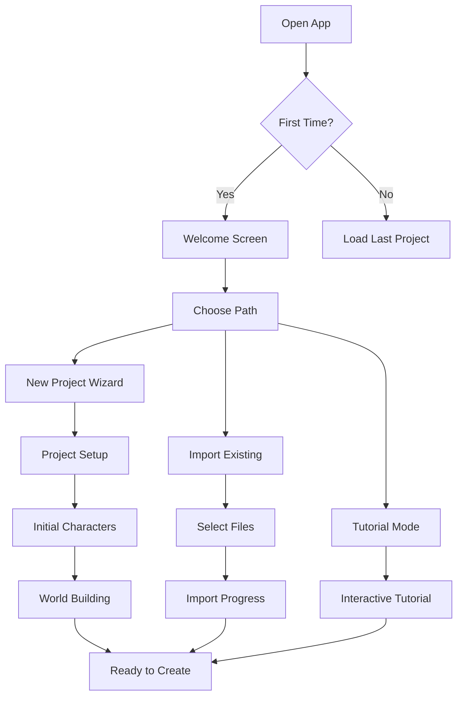
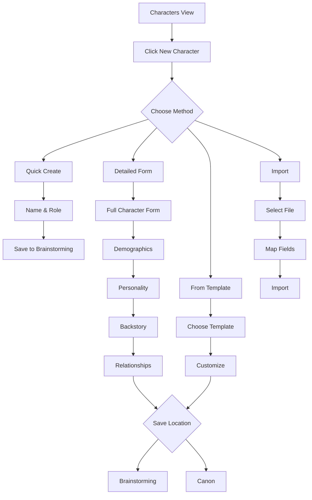
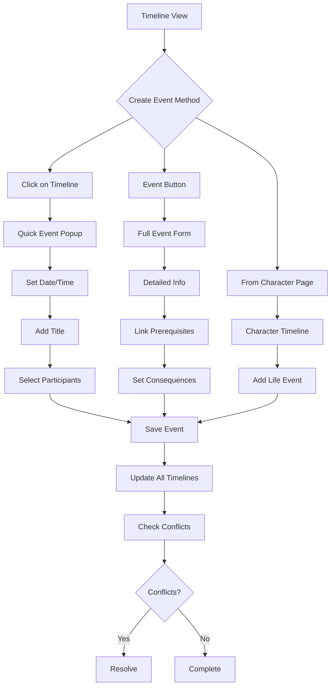
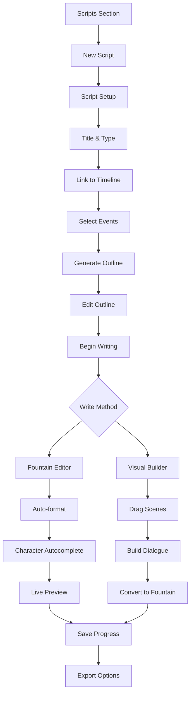
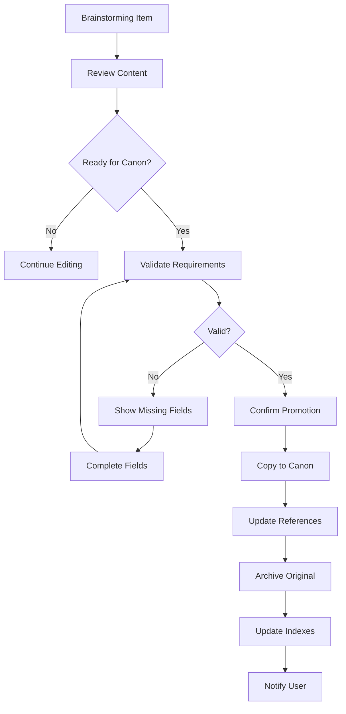

# StoryBlocks Detailed Requirements Specification

## Table of Contents

1. [Executive Summary](#executive-summary)
2. [System Architecture](#system-architecture)
3. [User Interface Requirements](#user-interface-requirements)
4. [Functional Requirements](#functional-requirements)
5. [Data Management](#data-management)
6. [User Workflows](#user-workflows)
7. [Technical Implementation](#technical-implementation)
8. [Testing Requirements](#testing-requirements)
9. [Performance Requirements](#performance-requirements)
10. [Security Requirements](#security-requirements)
11. [Accessibility Requirements](#accessibility-requirements)
12. [Future Enhancements](#future-enhancements)

## Executive Summary

StoryBlocks is a client-side story development application that requires a complete overhaul to become a professional-grade tool for writers. The application must provide intuitive workflows for managing complex narratives, characters, timelines, and screenplay writing without requiring any server infrastructure.

### Core Problems with Current Implementation

1. **Poor User Experience**: No onboarding, confusing navigation, unclear data states
2. **Limited Functionality**: Basic CRUD operations missing, no real timeline visualization
3. **No Data Validation**: Can corrupt data easily, no error handling
4. **Missing Features**: No screenplay editor, no brainstorming tools, no relationship visualization
5. **Poor Performance**: Loads all data at once, no caching, no optimization

## System Architecture

### Application Layers

```
┌─────────────────────────────────────────────────────────────┐
│                    Presentation Layer                        │
│  ┌─────────────┐  ┌──────────────┐  ┌─────────────────┐   │
│  │   React UI  │  │ Material-UI  │  │ Monaco Editor   │   │
│  └─────────────┘  └──────────────┘  └─────────────────┘   │
├─────────────────────────────────────────────────────────────┤
│                    Application Layer                         │
│  ┌─────────────┐  ┌──────────────┐  ┌─────────────────┐   │
│  │State Manager│  │ Route Handler│  │ Event System    │   │
│  └─────────────┘  └──────────────┘  └─────────────────┘   │
├─────────────────────────────────────────────────────────────┤
│                     Service Layer                            │
│  ┌─────────────┐  ┌──────────────┐  ┌─────────────────┐   │
│  │Data Service │  │ File Service │  │ Search Service  │   │
│  └─────────────┘  └──────────────┘  └─────────────────┘   │
├─────────────────────────────────────────────────────────────┤
│                      Data Layer                              │
│  ┌─────────────┐  ┌──────────────┐  ┌─────────────────┐   │
│  │File System  │  │ IndexedDB    │  │ Local Storage   │   │
│  └─────────────┘  └──────────────┘  └─────────────────┘   │
└─────────────────────────────────────────────────────────────┘
```

### Component Architecture

```typescript
interface AppState {
  user: UserState;
  project: ProjectState;
  ui: UIState;
  data: DataState;
}

interface DataState {
  characters: Map<string, Character>;
  locations: Map<string, Location>;
  events: Map<string, Event>;
  timelines: Map<string, Timeline>;
  themes: Map<string, Theme>;
  plots: Map<string, Plot>;
  scripts: Map<string, Script>;
  relationships: Map<string, Relationship>;
}

interface UIState {
  currentView: ViewType;
  selectedItems: Set<string>;
  filters: FilterState;
  sort: SortState;
  search: SearchState;
  modals: ModalState[];
  notifications: Notification[];
  theme: 'light' | 'dark' | 'auto';
}
```

## User Interface Requirements

### 1. Initial Setup Wizard

#### Welcome Screen
```
┌─────────────────────────────────────────────────────────┐
│                  Welcome to StoryBlocks                  │
│                                                         │
│  [Logo]                                                 │
│                                                         │
│  Create powerful stories with timeline-based            │
│  narrative management                                   │
│                                                         │
│  ┌─────────────────┐  ┌─────────────────┐             │
│  │  New Project    │  │  Open Project   │             │
│  └─────────────────┘  └─────────────────┘             │
│                                                         │
│  ┌─────────────────────────────────────┐               │
│  │  Import from Existing Data          │               │
│  └─────────────────────────────────────┘               │
└─────────────────────────────────────────────────────────┘
```

#### New Project Wizard (Multi-step)

**Step 1: Project Basics**
- Project Name (required)
- Project Subtitle (optional)
- Author Name (required)
- Genre Selection (multi-select)
- Target Medium (novel/screenplay/game/other)
- Estimated Length
- Start Date
- Target Completion Date

**Step 2: World Setup**
- Time Period (historical/contemporary/future/fantasy)
- Primary Locations (Earth/Mars/Other)
- Technology Level
- Magic System (if applicable)
- Key Themes (pre-populated suggestions + custom)

**Step 3: Initial Characters**
- Quick Character Creator
  - Name
  - Role (Protagonist/Antagonist/Supporting)
  - One-line description
  - Add up to 5 characters
  - Can skip and add later

**Step 4: Data Storage**
- Select storage location
- Enable auto-backup (with frequency)
- Enable cloud sync (future feature)
- Privacy settings

### 2. Main Application Interface

#### Header Bar
```
┌─────────────────────────────────────────────────────────────────┐
│ [≡] StoryBlocks | Project 521    [Search...] [?] [Bell] [User] │
└─────────────────────────────────────────────────────────────────┘
```

**Components:**
- Hamburger menu: Quick navigation, recent files, preferences
- Project name: Clickable dropdown for recent projects
- Global search: Instant search with filters
- Help: Context-sensitive help system
- Notifications: System messages, conflicts, reminders
- User menu: Settings, theme, logout

#### Navigation Sidebar
```
┌─────────────────┐
│ CREATION        │
│ ├ Timeline      │
│ ├ Characters    │
│ ├ Locations     │
│ ├ Events        │
│ └ Relationships │
│                 │
│ DEVELOPMENT     │
│ ├ Plots & Arcs  │
│ ├ Themes        │
│ ├ Brainstorming │
│ └ Research      │
│                 │
│ PRODUCTION      │
│ ├ Scripts       │
│ ├ Chapters      │
│ ├ Scenes        │
│ └ Dialogue      │
│                 │
│ TOOLS           │
│ ├ Analytics     │
│ ├ Export        │
│ └ Settings      │
└─────────────────┘
```

### 3. Timeline Interface

#### Timeline Controls
```
┌─────────────────────────────────────────────────────────────┐
│ [←] [→] [+] [-] [⟲] | Scale: [Dropdown] | Filter: [___]   │
│ ┌─────────────────────────────────────────────────────────┐│
│ │ 2020        2025        2030        2035        2040    ││
│ │  |           |           |           |           |       ││
│ │ ═══════════════════════════════════════════════════════ ││
│ │ Track 1: Global Events                                   ││
│ │  ├─[Event]──────[Event]─────────[Event]──────────       ││
│ │ ═══════════════════════════════════════════════════════ ││
│ │ Track 2: Aya Stone                                       ││
│ │  └──────[Birth]────[Academy]────[Takeover]───────       ││
│ │ ═══════════════════════════════════════════════════════ ││
│ │ Track 3: Mars Colony                                     ││
│ │  └───────────────[Founded]───[Expansion]─────────       ││
│ └─────────────────────────────────────────────────────────┘│
└─────────────────────────────────────────────────────────────┘
```

**Features:**
- Horizontal scrolling with momentum
- Vertical track management (add/remove/reorder)
- Event creation by clicking on timeline
- Drag and drop events between tracks
- Event connection lines
- Zoom levels: Century → Decade → Year → Month → Day → Hour
- Mini-map overview
- Track filtering and search
- Event clustering at low zoom levels
- Color coding by type/importance
- Relationship lines between events

### 4. Character Management

#### Character List View
```
┌─────────────────────────────────────────────────────────────┐
│ Characters (24)  [+ New] [Import] [Export]                  │
│ ┌─────────┐ ┌──────────────────────────────────────────┐  │
│ │ Filters │ │ [Grid] [List] [Tree]  Sort: [Name ▼]    │  │
│ │         │ ├──────────────────────────────────────────┤  │
│ │ □ Canon │ │ ┌─────────┐ ┌─────────┐ ┌─────────┐    │  │
│ │ □ Draft │ │ │ [IMG]   │ │ [IMG]   │ │ [IMG]   │    │  │
│ │         │ │ │Aya Stone│ │Vera Chen│ │Sara W.  │    │  │
│ │ Tags:   │ │ │Antagon. │ │Double   │ │Enforcer │    │  │
│ │ □ Protag│ │ │Earth    │ │Agent    │ │Earth    │    │  │
│ │ □ Antag │ │ └─────────┘ └─────────┘ └─────────┘    │  │
│ │ □ Support│ │ ┌─────────┐ ┌─────────┐ ┌─────────┐    │  │
│ │         │ │ │ [IMG]   │ │ [IMG]   │ │ [IMG]   │    │  │
│ │ Location│ │ │Elena V. │ │Bjorn H. │ │Sierra W.│    │  │
│ │ □ Earth │ │ │Mars Lead│ │Tech     │ │Commander│    │  │
│ │ □ Mars  │ │ │Genes    │ │Support  │ │Mars     │    │  │
│ └─────────┘ └──────────────────────────────────────────┘  │
└─────────────────────────────────────────────────────────────┘
```

#### Character Detail View
```
┌─────────────────────────────────────────────────────────────┐
│ [←] Aya Stone                    [Edit] [Delete] [Export]   │
│ ┌───────────┬─────────────────────────────────────────────┐│
│ │ [Image]   │ Dr. Aya Stone (Anna Stern)                  ││
│ │           │ Age: 38 | Status: Active | Location: Earth   ││
│ │ [Upload]  │ ─────────────────────────────────────────── ││
│ │           │ Tags: antagonist, foundation, tyrant         ││
│ └───────────┴─────────────────────────────────────────────┘│
│                                                             │
│ [Overview][Timeline][Relations][Notes][Gallery][Analytics]  │
│ ┌─────────────────────────────────────────────────────────┐│
│ │ Overview                                                 ││
│ │ ┌─────────────────────────────────────────────────────┐││
│ │ │ ## Character Summary                                 │││
│ │ │ An idealistic tyrant who genuinely believes she's   │││
│ │ │ saving humanity from AI-induced consciousness       │││
│ │ │ extinction...                                        │││
│ │ │                                                      │││
│ │ │ ## Personality                                       │││
│ │ │ Primary Motivation: Preserve authentic human...      │││
│ │ └─────────────────────────────────────────────────────┘││
│ └─────────────────────────────────────────────────────────┘│
└─────────────────────────────────────────────────────────────┘
```

### 5. Relationship Visualization

#### Network Graph View
```
┌─────────────────────────────────────────────────────────────┐
│ Relationships         [2D] [3D] [Filter] [Export]           │
│ ┌─────────────────────────────────────────────────────────┐│
│ │                      [Vera Chen]                         ││
│ │                     ↗    ║    ↖                         ││
│ │                   ↗      ║      ↖                       ││
│ │              romantic    ║    infiltrates               ││
│ │                ↗         ║         ↖                    ││
│ │          [Aya Stone]═════╬═════[Project 521]           ││
│ │              ↓      opposes           ↑                 ││
│ │           ally ↓                    works               ││
│ │              ↓                         ↑                ││
│ │      [Sara Washington]          [Marcus Chen]           ││
│ │              ?                                          ││
│ │              ?                                          ││
│ │      [Sierra Washington]                                ││
│ └─────────────────────────────────────────────────────────┘│
│ Legend: ═══ Strong  ─── Moderate  ··· Weak  ? Unknown     │
└─────────────────────────────────────────────────────────────┘
```

### 6. Screenplay Editor

#### Fountain Editor with Live Preview
```
┌─────────────────────────────────────────────────────────────┐
│ untitled_scene.fountain         [Save] [Export] [Settings]  │
│ ┌─────────────────────────┬─────────────────────────────┐ │
│ │ 1  INT. FOUNDATION HQ - │ INT. FOUNDATION HQ - NIGHT  │ │
│ │ 2                       │                             │ │
│ │ 3  The pinnacle of Earth│ The pinnacle of Earth's    │ │
│ │ 4  a gleaming pyramid of│ a gleaming pyramid of steel│ │
│ │ 5                       │ and glass pierces the      │ │
│ │ 6  AYA STONE (38), sharp│ cloud layer.               │ │
│ │ 7  in a tailored suit,  │                             │ │
│ │ 8  sky.                 │ AYA STONE (38), sharp eyes │ │
│ │ 9                       │ and perfect posture, stands│ │
│ │10  AYA                  │ in a tailored suit, gazing │ │
│ │11  The consciousness cri│ out at the darkened sky.   │ │
│ │12  controlled. The Foun │                             │ │
│ │13  ready.               │           AYA               │ │
│ │14                       │    The consciousness crisis │ │
│ │15  VERA enters silently.│    must be controlled. The │ │
│ │    [Auto-complete menu] │    Foundation must be ready.│ │
│ └─────────────────────────┴─────────────────────────────┘ │
│ Page 1 of 1 | Words: 47 | Est. Duration: 0:15            │
└─────────────────────────────────────────────────────────────┘
```

**Features:**
- Syntax highlighting for Fountain format
- Auto-completion for character names and locations
- Real-time formatting preview
- Page count estimation
- Scene navigation sidebar
- Character dialogue statistics
- Smart indentation
- Format conversion tools
- Revision tracking
- Collaboration comments

### 7. Brainstorming Interface

#### Idea Board
```
┌─────────────────────────────────────────────────────────────┐
│ Brainstorming                    [+ Card] [Import] [Clean]  │
│ ┌─────────────┬─────────────┬─────────────┬─────────────┐ │
│ │ Characters  │ Plot Ideas  │ Themes      │ World       │ │
│ ├─────────────┼─────────────┼─────────────┼─────────────┤ │
│ │ ┌─────────┐ │ ┌─────────┐ │ ┌─────────┐ │ ┌─────────┐ │ │
│ │ │New rival │ │ │Twin rev-│ │ │Free will│ │ │Mars cult│ │ │
│ │ │for Aya   │ │ │eal scene│ │ │vs deter-│ │ │discovers│ │ │
│ │ │         │ │ │         │ │ │minism   │ │ │truth    │ │ │
│ │ │[Convert]│ │ │[Convert]│ │ │[Convert]│ │ │[Convert]│ │ │
│ │ └─────────┘ │ └─────────┘ │ └─────────┘ │ └─────────┘ │ │
│ │ ┌─────────┐ │ ┌─────────┐ │ ┌─────────┐ │ ┌─────────┐ │ │
│ │ │Child of │ │ │Vera's   │ │ │Nature of│ │ │Foundation│ │
│ │ │Project  │ │ │betrayal │ │ │identity │ │ │splinter │ │ │
│ │ │521      │ │ │revealed │ │ │         │ │ │group    │ │ │
│ │ │[Convert]│ │ │[Convert]│ │ │[Convert]│ │ │[Convert]│ │ │
│ │ └─────────┘ │ └─────────┘ │ └─────────┘ │ └─────────┘ │ │
│ └─────────────┴─────────────┴─────────────┴─────────────┘ │
└─────────────────────────────────────────────────────────────┘
```

## Functional Requirements

### 1. Character Management Functions

#### Core CRUD Operations

```typescript
interface CharacterService {
  // Creation
  createCharacter(data: CharacterInput): Promise<Character>;
  createFromTemplate(template: CharacterTemplate): Promise<Character>;
  importCharacter(file: File): Promise<Character>;
  
  // Reading
  getCharacter(id: string): Promise<Character>;
  listCharacters(filter?: CharacterFilter): Promise<Character[]>;
  searchCharacters(query: string): Promise<Character[]>;
  
  // Updating
  updateCharacter(id: string, data: Partial<Character>): Promise<Character>;
  updateCharacterStatus(id: string, status: Status): Promise<Character>;
  addCharacterNote(id: string, note: Note): Promise<Character>;
  
  // Deletion
  deleteCharacter(id: string): Promise<void>;
  archiveCharacter(id: string): Promise<void>;
  
  // Relationships
  createRelationship(char1: string, char2: string, type: RelationType): Promise<Relationship>;
  updateRelationship(id: string, data: Partial<Relationship>): Promise<Relationship>;
  deleteRelationship(id: string): Promise<void>;
  
  // Bulk Operations
  importMultipleCharacters(file: File): Promise<Character[]>;
  exportCharacters(ids: string[], format: ExportFormat): Promise<Blob>;
  mergeCharacters(id1: string, id2: string): Promise<Character>;
}
```

#### Character Analysis Functions

```typescript
interface CharacterAnalytics {
  // Presence Analysis
  getScenePresence(characterId: string): ScenePresence[];
  getTimelinePresence(characterId: string): TimelinePresence;
  getWordCount(characterId: string): WordCountStats;
  
  // Relationship Analysis
  getRelationshipNetwork(characterId: string, depth: number): NetworkGraph;
  getRelationshipStrength(char1: string, char2: string): number;
  findCommonConnections(char1: string, char2: string): Character[];
  
  // Arc Analysis
  getCharacterArc(characterId: string): Arc;
  getEmotionalJourney(characterId: string): EmotionalPoint[];
  getMajorEvents(characterId: string): Event[];
  
  // Consistency Checks
  checkTimelineConflicts(characterId: string): Conflict[];
  checkAgeConsistency(characterId: string): AgeIssue[];
  checkLocationConflicts(characterId: string): LocationConflict[];
}
```

### 2. Timeline Management Functions

```typescript
interface TimelineService {
  // Timeline Creation
  createTimeline(data: TimelineInput): Promise<Timeline>;
  createCharacterTimeline(characterId: string): Promise<Timeline>;
  createLocationTimeline(locationId: string): Promise<Timeline>;
  
  // Event Management
  addEvent(timelineId: string, event: Event): Promise<Event>;
  updateEvent(eventId: string, data: Partial<Event>): Promise<Event>;
  moveEvent(eventId: string, newDate: Date): Promise<Event>;
  linkEvents(event1: string, event2: string, relation: EventRelation): Promise<void>;
  
  // Timeline Operations
  mergeTimelines(timeline1: string, timeline2: string): Promise<Timeline>;
  splitTimeline(timelineId: string, date: Date): Promise<[Timeline, Timeline]>;
  filterTimeline(timelineId: string, filter: TimelineFilter): Timeline;
  
  // Visualization
  getTimelineData(timelineId: string, scale: TimeScale): TimelineData;
  getEventClusters(timelineId: string, scale: TimeScale): EventCluster[];
  calculateEventDensity(timelineId: string): DensityMap;
}
```

### 3. Screenplay Functions

```typescript
interface ScreenplayService {
  // Script Management
  createScript(data: ScriptInput): Promise<Script>;
  parseScreenplay(fountain: string): ParsedScreenplay;
  formatScreenplay(script: ParsedScreenplay): string;
  
  // Scene Operations
  addScene(scriptId: string, scene: Scene): Promise<Scene>;
  reorderScenes(scriptId: string, newOrder: string[]): Promise<void>;
  splitScene(sceneId: string, position: number): Promise<[Scene, Scene]>;
  mergeScenes(scene1: string, scene2: string): Promise<Scene>;
  
  // Dialogue Operations
  getCharacterDialogue(scriptId: string, characterId: string): Dialogue[];
  analyzeDialogue(scriptId: string): DialogueStats;
  checkDialogueConsistency(scriptId: string): DialogueIssue[];
  
  // Export Functions
  exportToPDF(scriptId: string, settings: PDFSettings): Promise<Blob>;
  exportToFinalDraft(scriptId: string): Promise<Blob>;
  exportToFountain(scriptId: string): Promise<string>;
}
```

### 4. Search and Filter Functions

```typescript
interface SearchService {
  // Global Search
  globalSearch(query: string, options?: SearchOptions): SearchResults;
  
  // Entity-specific Search
  searchCharacters(query: string, filters?: CharacterFilter): Character[];
  searchEvents(query: string, dateRange?: DateRange): Event[];
  searchDialogue(query: string, scriptId?: string): DialogueResult[];
  
  // Advanced Search
  semanticSearch(query: string, threshold: number): SearchResults;
  regexSearch(pattern: string, scope: SearchScope): SearchResults;
  
  // Search Indexing
  indexContent(): Promise<void>;
  updateIndex(entityType: EntityType, id: string): Promise<void>;
  clearIndex(): Promise<void>;
}
```

### 5. File System Operations

```typescript
interface FileSystemService {
  // Directory Operations
  selectDataDirectory(): Promise<FileSystemDirectoryHandle>;
  createDirectory(path: string): Promise<FileSystemDirectoryHandle>;
  listDirectory(path: string): Promise<FileSystemHandle[]>;
  
  // File Operations
  readFile(path: string): Promise<string>;
  writeFile(path: string, content: string): Promise<void>;
  deleteFile(path: string): Promise<void>;
  moveFile(oldPath: string, newPath: string): Promise<void>;
  
  // Backup Operations
  createBackup(): Promise<string>;
  restoreBackup(backupId: string): Promise<void>;
  listBackups(): Promise<Backup[]>;
  
  // Watch Operations
  watchFile(path: string, callback: FileChangeCallback): WatchHandle;
  watchDirectory(path: string, callback: DirChangeCallback): WatchHandle;
}
```

### 6. Data Validation Functions

```typescript
interface ValidationService {
  // Character Validation
  validateCharacter(character: CharacterInput): ValidationResult;
  validateCharacterName(name: string, excludeId?: string): ValidationResult;
  validateCharacterAge(birthDate: Date, events: Event[]): ValidationResult;
  
  // Timeline Validation
  validateEvent(event: EventInput): ValidationResult;
  validateEventDate(date: Date, context: TimelineContext): ValidationResult;
  validateEventDuration(duration: Duration): ValidationResult;
  
  // Relationship Validation
  validateRelationship(rel: RelationshipInput): ValidationResult;
  checkRelationshipCycles(rel: RelationshipInput): boolean;
  
  // Script Validation
  validateFountain(text: string): ValidationResult;
  validateSceneHeading(heading: string): ValidationResult;
  validateCharacterCue(cue: string): ValidationResult;
}
```

### 7. Export/Import Functions

```typescript
interface ExportImportService {
  // Export Functions
  exportProject(format: ExportFormat): Promise<Blob>;
  exportCharacters(ids: string[], format: ExportFormat): Promise<Blob>;
  exportTimeline(id: string, format: TimelineExportFormat): Promise<Blob>;
  exportScript(id: string, format: ScriptExportFormat): Promise<Blob>;
  
  // Import Functions
  importProject(file: File): Promise<ImportResult>;
  importCharacters(file: File, options: ImportOptions): Promise<Character[]>;
  importTimeline(file: File): Promise<Timeline>;
  importScript(file: File, format: ScriptFormat): Promise<Script>;
  
  // Format Conversion
  convertMarkdownToHTML(markdown: string): string;
  convertFountainToFDX(fountain: string): string;
  convertJSONToCSV(data: any[]): string;
}
```

## Data Management

### 1. Data Models

```typescript
// Core Entity Interfaces
interface Character {
  id: string;
  name: string;
  aliases: string[];
  status: 'brainstorming' | 'canon' | 'archived';
  demographics: Demographics;
  appearance: Appearance;
  personality: Personality;
  backstory: Backstory;
  relationships: string[]; // Relationship IDs
  events: string[]; // Event IDs
  notes: Note[];
  tags: string[];
  metadata: Metadata;
}

interface Event {
  id: string;
  title: string;
  date: FlexibleDate;
  duration: Duration;
  description: string;
  participants: {
    characters: string[];
    locations: string[];
    items: string[];
  };
  consequences: string[]; // Event IDs
  prerequisites: string[]; // Event IDs
  tags: string[];
  visibility: 'public' | 'private' | 'draft';
  scale: 'moment' | 'scene' | 'chapter' | 'arc' | 'global';
  metadata: Metadata;
}

interface Relationship {
  id: string;
  participants: [string, string]; // Character IDs
  type: RelationType;
  strength: number; // 0-100
  description: string;
  history: RelationshipEvent[];
  status: 'active' | 'ended' | 'unknown';
  visibility: 'public' | 'private';
  metadata: Metadata;
}

interface Timeline {
  id: string;
  name: string;
  type: 'global' | 'character' | 'location' | 'plot' | 'custom';
  description: string;
  events: string[]; // Event IDs in chronological order
  tracks: Track[];
  scale: TimeScale;
  range: DateRange;
  metadata: Metadata;
}

interface Theme {
  id: string;
  name: string;
  description: string;
  questions: string[];
  symbols: Symbol[];
  relatedElements: {
    characters: string[];
    events: string[];
    locations: string[];
    plots: string[];
  };
  evolution: ThemeEvolution[];
  metadata: Metadata;
}

interface Script {
  id: string;
  title: string;
  type: 'feature' | 'episode' | 'short' | 'scene';
  format: 'fountain' | 'fdx' | 'pdf';
  content: string;
  scenes: Scene[];
  characters: string[]; // Character IDs appearing
  locations: string[]; // Location IDs used
  revision: number;
  status: 'outline' | 'draft' | 'revision' | 'final';
  metadata: Metadata;
}

// Supporting Types
interface Demographics {
  birthDate?: FlexibleDate;
  deathDate?: FlexibleDate;
  age?: string;
  gender?: string;
  ethnicity?: string;
  nationality?: string;
  occupation?: string;
  education?: string;
  socioeconomicStatus?: string;
}

interface FlexibleDate {
  type: 'exact' | 'approximate' | 'range' | 'relative';
  value: string; // ISO date, year, or description
  display: string; // Human-readable format
}

interface Metadata {
  created: Date;
  modified: Date;
  version: number;
  author: string;
  locked: boolean;
  hash: string; // For conflict detection
}
```

### 2. Data Storage Strategy

```typescript
interface StorageStrategy {
  // File Organization
  structure: {
    '/project.json': ProjectConfig;
    '/data/canon/characters/[id]/': {
      'profile.json': Character;
      'about.md': string;
      'notes/[title].md': string;
      'timeline.json': Timeline;
      'relationships.json': Relationship[];
    };
    '/data/brainstorming/': {
      // Mirror of canon structure
    };
    '/data/events/[id].json': Event;
    '/data/timelines/[id].json': Timeline;
    '/data/scripts/[id]/': {
      'metadata.json': ScriptMetadata;
      'screenplay.fountain': string;
      'revisions/[timestamp].fountain': string;
    };
  };
  
  // Caching Strategy
  cache: {
    memory: {
      recentCharacters: LRUCache<Character>;
      activeTimeline: Timeline;
      searchIndex: SearchIndex;
    };
    indexedDB: {
      fileHandles: Map<string, FileSystemHandle>;
      metadata: Map<string, Metadata>;
      preferences: UserPreferences;
    };
    localStorage: {
      theme: Theme;
      recentProjects: string[];
      uiState: UIState;
    };
  };
}
```

### 3. Data Synchronization

```typescript
interface SyncService {
  // Conflict Detection
  detectConflicts(): Promise<Conflict[]>;
  resolveConflict(conflict: Conflict, resolution: Resolution): Promise<void>;
  
  // Auto-save
  enableAutoSave(interval: number): void;
  saveChanges(): Promise<SaveResult>;
  
  // Version Control
  createCheckpoint(message: string): Promise<Checkpoint>;
  listCheckpoints(): Promise<Checkpoint[]>;
  restoreCheckpoint(id: string): Promise<void>;
  
  // Multi-device Sync (Future)
  syncToCloud(): Promise<SyncResult>;
  pullFromCloud(): Promise<SyncResult>;
  resolveCloudConflicts(conflicts: CloudConflict[]): Promise<void>;
}
```

## User Workflows

### 1. New User Onboarding Flow



### 2. Character Creation Workflow



### 3. Timeline Event Creation



### 4. Screenplay Writing Workflow



### 5. Brainstorming to Canon Promotion



## Technical Implementation

### 1. Technology Stack

```yaml
Frontend Framework: React 18+ with TypeScript
UI Library: Material-UI v5 / Ant Design
State Management: Zustand / Redux Toolkit
Routing: React Router v6
Editor: Monaco Editor (VS Code engine)
Markdown: Unified (remark/rehype)
Search: FlexSearch
Visualization: D3.js + React Flow
Screenplay: Custom Fountain parser
PDF Generation: jsPDF + html2canvas
File System: File System Access API
Storage: IndexedDB (Dexie.js)
Testing: Jest + React Testing Library
Build Tool: Vite
Linting: ESLint + Prettier
```

### 2. Application Architecture

```typescript
// Core Application Structure
interface Application {
  // Singleton Services
  fileSystem: FileSystemService;
  dataService: DataService;
  searchService: SearchService;
  validationService: ValidationService;
  syncService: SyncService;
  analyticsService: AnalyticsService;
  
  // State Management
  store: ApplicationStore;
  
  // UI Controllers
  router: RouterController;
  modalController: ModalController;
  notificationController: NotificationController;
  themeController: ThemeController;
  
  // Event System
  eventBus: EventBus;
  
  // Plugin System
  pluginManager: PluginManager;
}

// Modular Architecture
src/
├── core/
│   ├── services/
│   ├── models/
│   ├── utils/
│   └── constants/
├── features/
│   ├── characters/
│   ├── timeline/
│   ├── screenplay/
│   ├── brainstorming/
│   └── relationships/
├── ui/
│   ├── components/
│   ├── layouts/
│   ├── themes/
│   └── hooks/
├── state/
│   ├── store/
│   ├── actions/
│   └── selectors/
└── plugins/
    ├── api/
    └── examples/
```

### 3. Performance Optimizations

```typescript
interface PerformanceStrategy {
  // Lazy Loading
  lazyLoad: {
    routes: string[];
    components: string[];
    data: DataLoadStrategy;
  };
  
  // Virtualization
  virtualize: {
    characterList: boolean;
    timeline: boolean;
    searchResults: boolean;
  };
  
  // Caching
  cache: {
    rendered: WeakMap<any, ReactElement>;
    computed: Map<string, any>;
    queries: LRUCache<string, QueryResult>;
  };
  
  // Web Workers
  workers: {
    search: Worker;
    validation: Worker;
    export: Worker;
  };
  
  // Debouncing
  debounce: {
    search: 300;
    save: 1000;
    validation: 500;
  };
}
```

## Testing Requirements

### 1. Unit Tests

```typescript
describe('CharacterService', () => {
  describe('createCharacter', () => {
    it('should create character with valid data', async () => {
      const character = await characterService.createCharacter({
        name: 'Test Character',
        status: 'brainstorming'
      });
      expect(character.id).toBeDefined();
      expect(character.name).toBe('Test Character');
    });
    
    it('should reject duplicate names', async () => {
      await characterService.createCharacter({ name: 'Duplicate' });
      await expect(
        characterService.createCharacter({ name: 'Duplicate' })
      ).rejects.toThrow('Character name must be unique');
    });
  });
});
```

### 2. Integration Tests

```typescript
describe('Timeline Integration', () => {
  it('should update all related timelines when event is modified', async () => {
    const event = await eventService.createEvent({
      title: 'Test Event',
      participants: { characters: ['char-1', 'char-2'] }
    });
    
    await eventService.updateEvent(event.id, { date: '2025-01-01' });
    
    const globalTimeline = await timelineService.getTimeline('global');
    const char1Timeline = await timelineService.getCharacterTimeline('char-1');
    
    expect(globalTimeline.events).toContain(event.id);
    expect(char1Timeline.events).toContain(event.id);
  });
});
```

### 3. E2E Tests

```typescript
describe('Character Creation Flow', () => {
  it('should create character from start to finish', async () => {
    await page.goto('/characters');
    await page.click('[data-testid="new-character"]');
    await page.fill('[name="name"]', 'E2E Test Character');
    await page.selectOption('[name="status"]', 'brainstorming');
    await page.click('[data-testid="save-character"]');
    
    await expect(page).toHaveURL(/\/characters\/[a-z0-9-]+/);
    await expect(page.locator('h1')).toContainText('E2E Test Character');
  });
});
```

## Performance Requirements

1. **Load Time**: Initial app load < 3 seconds
2. **File Operations**: Save/load < 500ms for typical files
3. **Search**: Results appear within 100ms of typing
4. **Timeline Rendering**: Smooth 60fps scrolling with 1000+ events
5. **Memory Usage**: < 500MB for typical project
6. **Offline Capability**: Full functionality without internet

## Security Requirements

1. **Data Encryption**: Option to encrypt sensitive project data
2. **Access Control**: File system permissions respected
3. **Input Validation**: All user input sanitized
4. **XSS Prevention**: Markdown rendering sanitized
5. **Content Security Policy**: Strict CSP headers
6. **Backup Integrity**: Checksums for backup verification

## Accessibility Requirements

1. **WCAG 2.1 AA Compliance**
2. **Keyboard Navigation**: All features keyboard accessible
3. **Screen Reader Support**: Proper ARIA labels
4. **High Contrast Mode**: Full theme support
5. **Focus Indicators**: Clear focus states
6. **Reduced Motion**: Respect prefers-reduced-motion

## Future Enhancements

### Phase 2 Features
1. **Collaboration**: Real-time multi-user editing
2. **AI Assistant**: Character dialogue suggestions
3. **Mobile Apps**: iOS/Android companions
4. **Cloud Sync**: Cross-device synchronization
5. **Plugin Marketplace**: Community extensions

### Phase 3 Features
1. **Voice Input**: Dictation for all text fields
2. **AR/VR Visualization**: 3D timeline exploration
3. **AI Analysis**: Plot hole detection
4. **Translation**: Multi-language support
5. **Publishing**: Direct to platform publishing

## Conclusion

This comprehensive requirements document outlines the complete overhaul needed to transform StoryBlocks from a basic prototype into a professional-grade story development platform. The implementation should prioritize user experience, data integrity, and performance while maintaining the flexibility needed for creative work.